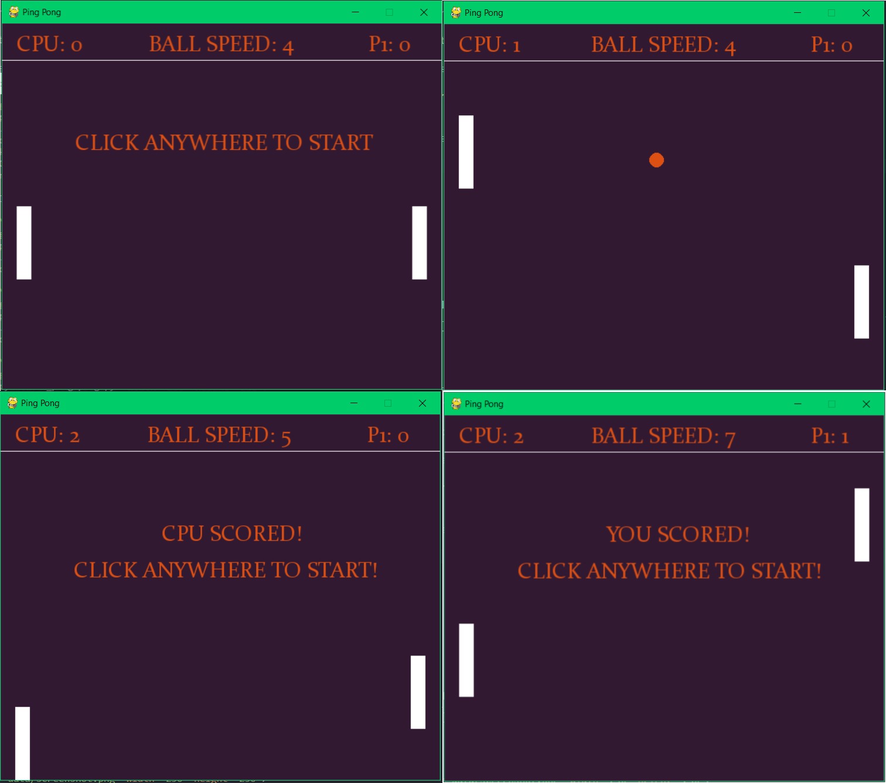
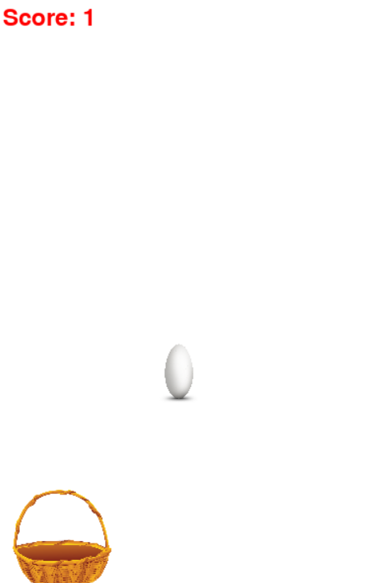
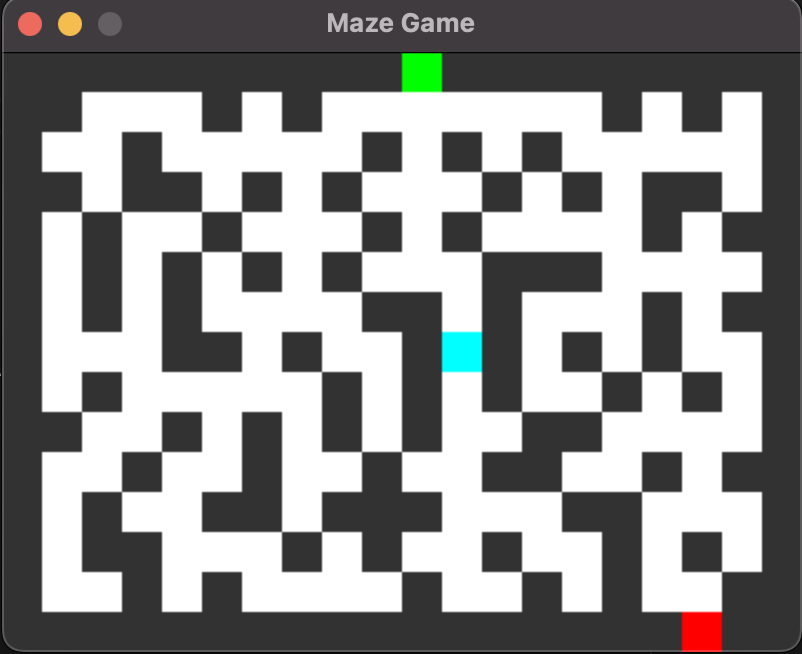

### Task 1 (Ping Pong)

In this task _Ping Pong_ some variables with classes `Ball` and `Paddle` are defined. Check the file named **ai_ping-pong.py**.

_class Ball_

- The `move()` function updates the `winner` variable in the game
- The `draw()` function draws a ball object
- The `reset()` function places the ball object where you define `x` and `y` coordinates

_class Paddle_

- The `move()` function moves the paddle as a player
- The `ai()` function moves the paddle as a robot
- The `draw()` function draws the paddle object

Your mission is to write game logic.

**_Missions:_** TODO

- Define the **font** and **fps**. (font and fps are up to you)
- Draw the scores that located at the top of the screen. (You can create a function that draws text based on screen location))
  
- Define 2 states of the ball during the game.
  - When the ball is in play (**live_ball** = True, should be True when mouse clicked the screen, and when not playing = False)
    - Each time increase the speed by 1
    - Move the ball until a winner is found
    - Scores should be increased depending on the winner
  - When the ball is out of play (**live_ball** = False)
    - Show instructions as shown in the picture above. Locate near the center.
- Define Event handler
  - Quit the game
  - Start the game by clicking the screen or any button.

### Task 2

### Task 3

You are given already completed classic snake game, so your task would be to add some text. Developer that made game 
leaved TODOs that must be completed in order to make game ready for release. So, your task is to complete them, by 
adding texts with font and color. You are free to choose them, as the designer is on vacation, and we must release the 
game in couple days. Almost forgot, there also one more leaved TODO, where you have to do stuff when snake reached
apple. Things must be done are:
- add new apple
- make snake longer for one
- slow down snake, but the speed must be stay at least 4.

The source code of game can be found in `classic_snake.py`. Good luck!

### Task 4

### Task 5

Your goal is to write a "Eggs Catcher" game in python using pygame library.You have to count the user score and display it on the screen. User can miss maximum 3 eggs, otherwise user loses. Display the final score of the user on the screen. All png files are stored in the data folder.

The game should look like this:



### Task 6

### Task 7

### Task 8

### Task 9
You are tasked with creating a maze game using Pygame. The maze should have an entrance and an exit, and the player should start at the entrance and navigate their way to the exit.

Here are the specific requirements for the game:

* The maze should be generated using a 2D array, where each cell is either a wall ('W'), a path ('P'), the entrance ('E'), or the exit ('X').
* The maze should be displayed on the screen, with walls displayed as black rectangles, paths displayed as white rectangles, and the entrance and exit displayed as green and red rectangles, respectively.
* The player should be represented as a blue rectangle and should be able to move using the arrow keys.
* The player should start at the entrance and should be able to navigate their way to the exit.
* When the player reaches the exit, a message should be displayed on the screen indicating that they have won the game.

You can find maze generator here [maze.py](maze.py)




### Task 10

### Task 11

Your task is create "Word Guess" game. You have to create at least two scene (start scene and game scene).  
In game scene user tries guess letter of the hidden word, this word is randomly taken from file (if file does not exist user default word).  
If user guesses letter right, input for this letter is readonly.  
If user guesses word, show winner message.

For this task, you should use several scenes, you can use class below or anythig you want:

```python
class SceneBase:
    def __init__(self):
        pass

    def __init__(self, prev):
        pass

    def ProcessInput(self, events, pressed_keys):
        pass

    def Update(self):
        pass

    def Render(self, screen):
        pass

    def SwitchToScene(self, next_scene):
        pass

    def SwitchBack(self):
        pass

    def Terminate(self):
        pass

```

### Task 12

### Task 13
- Create a game similar to "Asteroids".
- Use Pygame to create a window with a black background.
- Create a ship that can rotate and move forward.
- The ship should start in the center of the window facing upwards.
- Allow the user to control the ship using the arrow keys on the keyboard.
- The left and right arrow keys should rotate the ship.
- The up arrow key should move the ship forward in the direction it is facing.
- Create asteroids that move randomly around the screen.
- The asteroids should start at random locations on the screen and have random sizes.
- If the ship collides with an asteroid, the player loses a life.
- The game should end if the player runs out of lives.
- Display the score and number of lives on the screen.
- When the game ends, display a "Game Over" message for a few seconds before exiting.

### Task 14
Create a game where the player controls a character that must jump over obstacles and collect coins.

Gameplay:

- game should start with a character positioned at the left side of the screen and a number of obstacles and coins randomly positioned on the right side of the screen.
- character should be able to move left and right using the arrow keys.
- character should be able to jump using the space key. When the character jumps, it should move up and then down again.
- obstacles should move from right to left across the screen at a constant speed.
- coins should also move from right to left across the screen at a constant speed.
- If the character collides with an obstacle, the game should end.
- If the character collects a coin, the score should increase by one.
- The game should end after a certain time or when the character collides with an obstacle too many times.
Graphics:

- game should be displayed in a window with a fixed size.
- obstacles should be simple rectangles of a fixed size and color.
- coins should be simple circles of a fixed size and color.
- character should be a simple rectangle of a fixed size and color.

- score should increase by one for each coin collected.
- When the game ends, the final score should be displayed on the screen.
